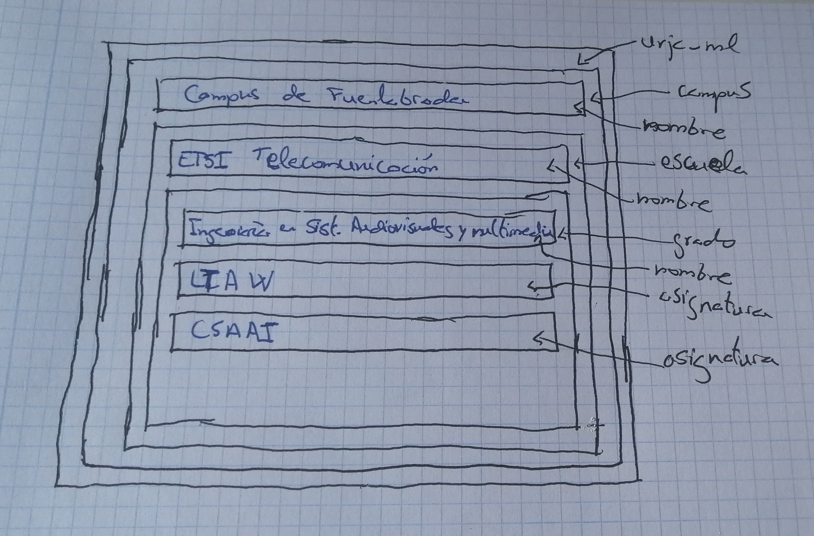
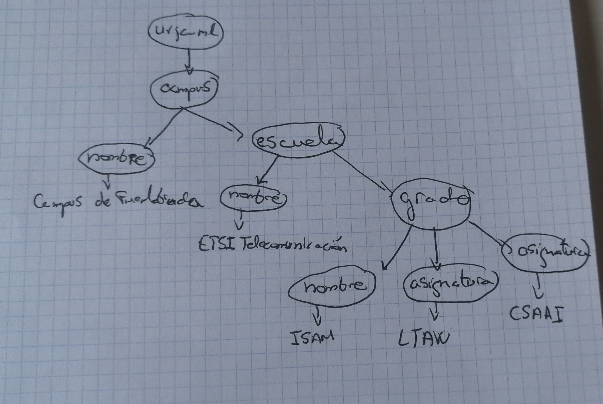
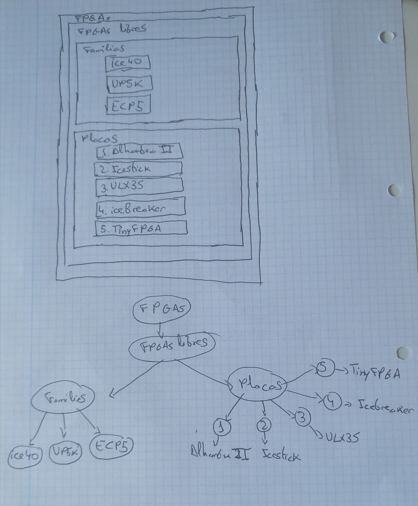

# Ejercicio 1

* a) Sirve para indicar la ubicación del fichero *.dtd* donde se define el lenguaje usado. Es necesaria porque indica al programa que va a procesar el documento cómo tratae cada etiqueta.

* b) No se podría procesar el documento, por lo que no se podría visualizar correctamente el documento.

* c) Sí, ya que cierra todas las etiquetas que abre y no se da ninguna incongruencia del tipo de que la etiqueta *grado*, contenida dentro de la etiqueta *campus*, contenga posteriormente a la etiqueta *campus*.

* d) Pone un comentario.

* e) 8 de apertura y 8 de cierre.

* f) 

* g) 

# Ejercicio 2

* a) 
```html
 <!DOCTYPE universidad SYSTEM "universidad.dtd">
 <Universidad>
    <Escuela>
        <Nombre>ETSI Telecomunicación</Nombre>
        <Grado>
            <Nombre>Ingeniería en Sistemas Audiovisuales y Multimedia</Nombre>
            <Asignatura>LTAW</Asignatura>
            <Asignatura>CSAII</Asignatura>
            <Asignatura>ASA II</Asignatura>
        </Grado>
        <Grado>
            <Nombre>Ingeniería en Robótica Software</Nombre>
            <Asignatura>AC</Asignatura>
        </Grado>
    </Escuela>
</Universidad>
```
# Ejercicio 3

* a)
```html
<!DOCTYPE generic SYSTEM "generic.dtd">
<Generic>
    <Contenedor>Texto 5
        <Contenedor>
            <Contendenor>
                <Contendedor>Texto 1</Contenedor>
                Texto 2
            </Contenedor>
            Texto 3
            <Contenedor>Texto 4</Contenedor>
        </Contenedor>
    </Contenedor>
</Generic>
```

# Ejercicio 4
